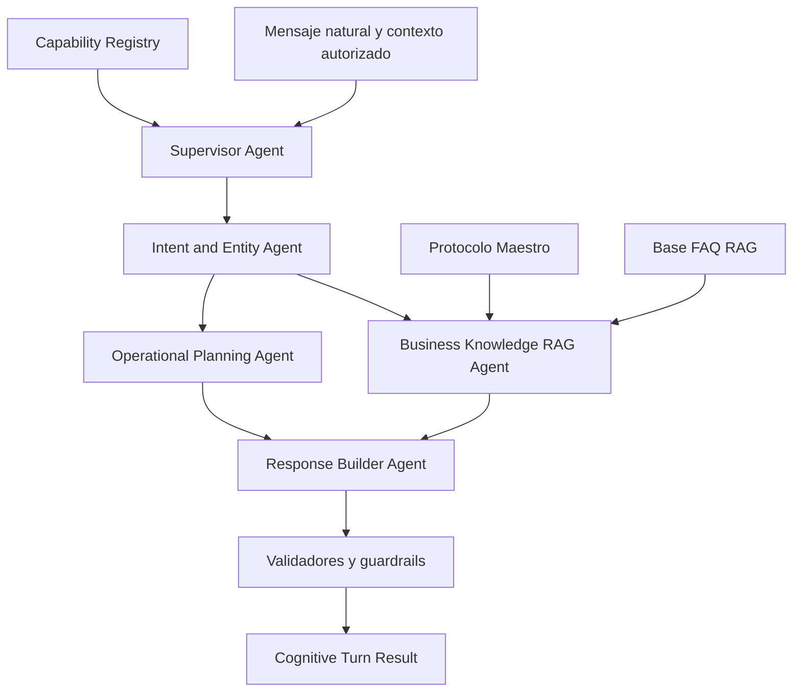

# Diseño — Cognitive Turn Routing MVP (Rebaseline Agentic + RAG)

## Arquitectura agentic obligatoria



### Responsabilidades

| Componente | Tipo | Responsabilidad |
|------------|------|-----------------|
| Supervisor Agent | Agente | Coordina el turno; decide qué especialistas invocar |
| Intent and Entity Agent | Agente | Interpreta lenguaje natural, identifica intenciones y entidades |
| Business Knowledge RAG Agent | Agente | Recupera y responde desde fuentes documentales |
| Operational Planning Agent | Agente | Descompone acciones y establece dependencias |
| Response Builder Agent | Agente | Construye respuesta bancaria visible grounded |
| Capability Registry | Determinista | Filtra y valida capacidades |
| Validadores y guardrails | Determinista | Valida contratos, seguridad, schemas |

No se fuerzan múltiples llamadas para todos los turnos. El camino simple
(SINGLE + respuesta directa) puede usar un único agente con structured output.
Los especialistas se invocan bajo demanda según la complejidad.

---

## Flujo end-to-end

```
1. turn_endpoint recibe orchestrator_turn_request
2. InputValidator valida schema + authenticated
3. ContextAssembler ensambla cognitive_turn_request
4. ModelInputBuilder proyecta SemanticTurnInput (sin IDs confiables)
5. Supervisor Agent (Agent Framework real):
   a. Intent and Entity Agent interpreta
   b. Si BUSINESS_RAG → RAG Agent recupera de fuentes
   c. Si multi-acción → Planning Agent descompone
   d. Response Builder construye respuesta visible
6. Validadores determinísticos:
   a. CapabilityCatalog.validate_interpretation()
   b. RouteTable.complete()
   c. ResolutionAssembler inyecta IDs, domain, family, next_action
7. Telemetría segura
8. Retorna CognitiveTurnResult
```

---

## CognitiveTurnResult

Contiene:
- `intent_resolution`: contrato tipado para el orquestador
- `assistant_response_candidate`: respuesta bancaria visible
- `rag_trace`: trazabilidad de recuperación documental
- Metadatos: prompt_id, prompt_version, model_id, model_version, catalog_version

---

## Fuentes RAG

| Fuente | Tipo | Indexación |
|--------|------|-----------|
| Protocolo Maestro | source_type=protocol | Prioridad crítica |
| Base FAQ | source_type=faq | Chunk por FAQ con metadatos completos |

Metadatos por chunk FAQ:
chunk_id, pregunta, respuesta, intent, domain_category, product_type,
sensitivity_level, transactional, requires_authentication, requires_confirmation,
priority, página, versión documental.

---

## Componentes existentes (preservados)

- InputValidator, ContextAssembler, ModelInputBuilder
- CapabilityCatalog, RouteTable, CapabilityManifest
- PromptRegistry, PromptVersion, PromptValidator
- Adaptadores in-memory para contexto
- Schemas JSON (orchestrator, cognitive, turn_interpretation, intent_resolution, error_response, capability_manifest)
- Tipos Pydantic estrictos
- Telemetría segura

## Componentes nuevos (T08+)

- Knowledge Base ingestion (chunking, metadatos)
- Retrieval port y adaptador RAG
- Agent Framework Resolver real
- Supervisor Agent
- Intent and Entity Agent
- Business Knowledge RAG Agent
- Operational Planning Agent
- Response Builder Agent
- CognitiveTurnResult assembler
- Dataset semántico real
- Evaluación ejecutada

---

## Directriz normativa

Versión: 1.3
Ruta: `C:\Users\boris\Documents\Genesis\Genesis_v2\.kiro\steering\mandatory-project-directives.md`
