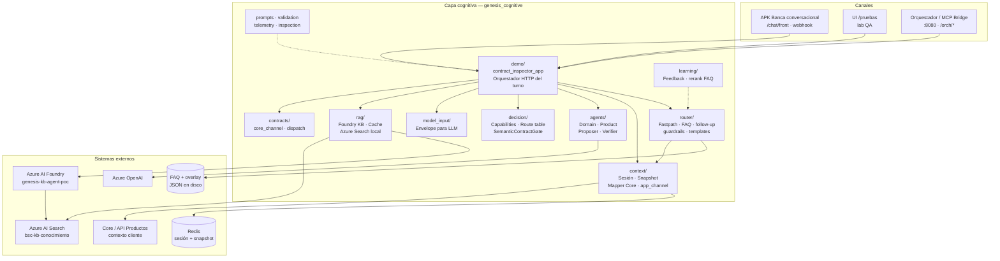
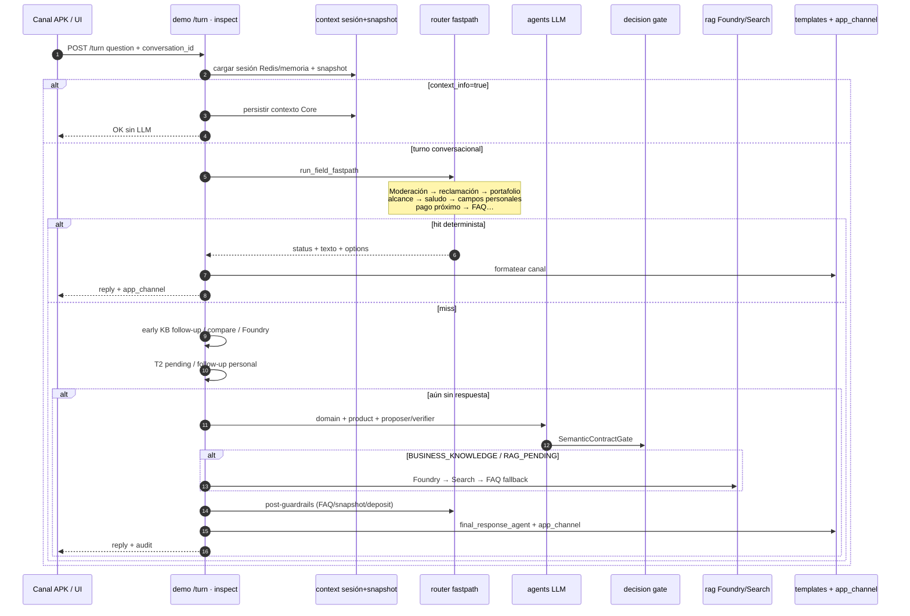
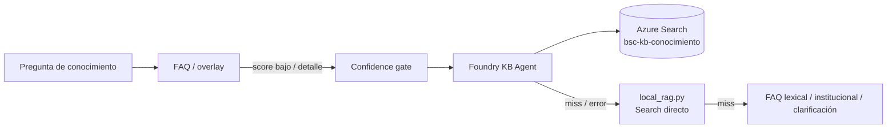
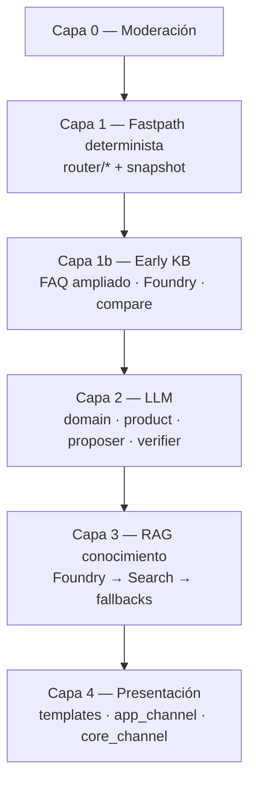

# Arquitectura funcional — Capa cognitiva Genesis (AS-IS)

| Campo | Valor |
|-------|-------|
| **Fecha** | 2026-09-14 |
| **Alcance** | Capa cognitiva `src/genesis_cognitive` tal como está desplegada hoy |
| **Instancia de referencia** | QA **:8447** (`http://20.127.25.24:8447`) |
| **Entrada principal** | `POST /turn` → `demo/contract_inspector_app.py` → `inspect()` |
| **Propósito del documento** | Diagrama de componentes + explicación funcional de cada pieza |

---

## 1. Principio de diseño (hoy)

La cognitiva separa dos mundos y **no los mezcla**:

| Tipo de pregunta | Quién responde | Fuente de verdad |
|------------------|----------------|------------------|
| **Personal** (saldo, mi préstamo, mi tarjeta, fecha de pago mía, cuota…) | Cognitiva + snapshot del cliente | API Productos / Core → `CustomerContextSnapshot` |
| **Conocimiento** (qué es, catálogo, requisitos, reclamaciones, misión…) | FAQ/overlay → **Foundry KB** → Azure Search local → fallbacks | `kb_faq_*.json` + índice `bsc-kb-conocimiento` |

**Regla dura:** Foundry **no** inventa ni responde saldos, límites, cuotas ni fechas personales del portafolio autenticado.

---

## 2. Diagrama de componentes (vista lógica)



---

## 3. Diagrama de secuencia de un turno (AS-IS)



---

## 4. Explicación de cada componente

### 4.1 Canales (fuera del paquete, pero dependientes)

| Componente | Qué hace hoy |
|------------|--------------|
| **APK Banca conversacional** | Envía turnos a `/chat/front` (alias de `/turn`). Consume `reply` / `message` / `content` y `app_channel` (options, chips, masks). |
| **UI `/pruebas`** | Laboratorio QA en :8447 para probar sin APK. |
| **Orquestador / MCP Bridge** | Proxy `/orch/*`. Login y carga de contexto; la cognitiva no “es” el Core, lo consume. |

---

### 4.2 `demo/` — Orquestador HTTP del turno

**Archivo clave:** `demo/contract_inspector_app.py`

Es el **cerebro de orquestación** de la instancia cognitiva:

- Expone `POST /turn`, `/inspect`, `/chat/front`, `/pruebas`, proxies `/orch/*`.
- Resuelve `customer_id` / `conversation_id`, carga sesión y snapshot.
- Ejecuta el pipeline completo (fastpath → early KB → follow-ups → LLM → RAG → templates).
- Arma la respuesta de canal (`app_channel`) y, si aplica, `core_channel`.
- Mantiene estado conversacional: `last_resolved`, `pending_action`, `product_focus`, `last_knowledge_topic`.

Sin este módulo no hay “capa cognitiva viva”: el resto son bibliotecas que él compone.

---

### 4.3 `router/` — Fastpath determinista y políticas de routing

**Archivos clave:**

| Archivo | Rol |
|---------|-----|
| `field_guardrails.py` | `run_field_fastpath`: orden de reglas sin LLM |
| `moderation.py` | Higiene de lenguaje (capa 0) |
| `faq_guardrail.py` | Match FAQ base + overlay |
| `knowledge_followup.py` | Follow-ups cortos de KB + confidence gate |
| `reclamacion_guardrail.py` | Procesos de reclamación / overview |
| `scope_guardrail.py` | “¿En qué me puedes ayudar?” |
| `deposit_guardrail.py` | Cuentas / saldos específicos |
| `snapshot_guardrails.py` | Campos de préstamo desde snapshot |
| `product_focus.py` | Memoria de producto personal vs KB |
| `final_response_agent.py` | Templates de préstamo / TC / DAP / multi-campo |

**Qué resuelve sin LLM (ejemplos actuales):**

- Saldos, límites, cortes, deudas de tarjeta.
- Fechas de pago, escaneo “¿tengo préstamo o tarjeta con pago próximo?”.
- Multi-pregunta de tarjeta (saldo + mínimo + disponible).
- Débito personal vs crédito (no confundir catálogo/portafolio).
- FAQ institucional (misión, glosario, etc.).
- Clarificaciones con options APK cuando hay ambigüedad real.

**Orden conceptual del fastpath (simplificado):**

```
Moderación
  → Reclamación / portafolio / alcance / saludo
  → Préstamos · tarjetas · DAP · saldos · pagos próximos
  → FAQ / overlay
```

---

### 4.4 `context/` — Sesión, portafolio y canal

| Pieza | Rol AS-IS |
|-------|-----------|
| `customer_context_snapshot.py` | Modelo inmutable del portafolio (cuentas, TC, préstamos, DAP). |
| `core_portfolio_mapper.py` | Traduce respuesta Core/API Productos → snapshot. |
| `redis_session_store.py` | Persistencia de sesión/snapshot en Redis. |
| `reactive_store.py` | Fallback in-memory (lab) + tipos de sesión (`LastResolved`, `PendingAction`, `ProductFocus`). |
| `app_channel.py` | Options APK, disambiguation questions, labels de producto. |
| `product_display.py` | Máscaras, listados, clarificaciones, multi-saldo. |
| `response_formatting.py` | Fichas rich (TC, préstamo, DAP) y `format_money`. |

**Datos personales solo salen de aquí.** Si Core no trae un campo (ej. cuota contractual), la cognitiva lo declara no disponible; no lo inventa.

---

### 4.5 `agents/` — Camino LLM (cuando el fastpath no alcanza)

| Pieza | Rol |
|-------|-----|
| `agent_framework_turn_resolver.py` | Orquesta llamadas al Microsoft Agent Framework / Azure OpenAI. |
| Clasificadores de dominio / producto | `own_product` · `business_knowledge` · `ood` · `non_operational` y read vs mutation. |
| `semantic_verifier.py` | Verifica la propuesta del modelo contra contratos semánticos. |
| `semantic_schema_builder.py` / `model_cognitive_result.py` | Schemas y resultado cognitivo tipado. |

El LLM **no** es la primera opción: entra cuando no hay hit determinista y la pregunta no se resolvió en early Foundry/FAQ.

---

### 4.6 `decision/` — Catálogo de capacidades y gate post-modelo

| Pieza | Rol |
|-------|-----|
| `capability_catalog.py` | Qué intents/capabilities existen (saldo, detalle TC, KB, etc.). |
| `route_table.py` | Rutas (`PERSONAL_READ`, conocimiento, unsupported…). |
| `semantic_contract_gate.py` | Valida que la salida del modelo respete el contrato (refs, missing requirements, etc.). |
| `types.py` / `capability_types.py` | Tipos de decisión. |

---

### 4.7 `model_input/` — Envelope hacia el modelo

**Archivo clave:** `model_input/model_input_builder.py`

Construye el `ModelInput` con:

- Capabilities efectivas del catálogo.
- Hint de dominio / producto.
- Historial proyectado de la conversación.
- Contexto de sesión (pending, last_resolved).

Evita que el LLM “vea” más de lo autorizado para ese turno.

---

### 4.8 `rag/` — Conocimiento institucional



| Pieza | Rol |
|-------|-----|
| `foundry_kb_agent.py` | Cliente del agente Foundry (`genesis-kb-agent-poc`). |
| `foundry_kb_cache.py` | Cache local de respuestas KB no personales. |
| `local_rag.py` | RAG directo contra Azure Search + generación Azure OpenAI. |
| `kb_intent_resolver.py` | Resolución lexical auxiliar de temas KB. |

**Flags típicos en :8447:**

- `GENESIS_FOUNDRY_KB_AGENT=1`
- `GENESIS_KB_CONFIDENCE_GATE=1`
- `GENESIS_FOUNDRY_CACHE=1`
- `AZURE_SEARCH_INDEX=bsc-kb-conocimiento`
- `GENESIS_FAQ_OVERLAY_PATH=…/kb_faq_overlay_fase1.json`

---

### 4.9 `contracts/` — Puente hacia Core / operaciones

| Pieza | Rol |
|-------|-----|
| `operation_request_adapter.py` | Arma `core_channel` / operation request cuando el turno implica contrato hacia Core. |
| `deterministic_dispatch.py` | Dispatch determinista de operaciones (cuando aplica). |

Hoy la cognitiva es **sobre todo consulta**; mutaciones (transferir, pagar) suelen quedar en unsupported / mensaje de canal no habilitado.

---

### 4.10 `learning/` — Aprendizaje auxiliar (no orquesta el turno)

| Pieza | Rol |
|-------|-----|
| `feedback_store.py` | Almacén de feedback (SQLite). |
| `embedding_rerank.py` | Rerank por embeddings para mejorar ranking FAQ/RAG. |

No sustituye al fastpath ni a Foundry; es soporte de mejora continua.

---

### 4.11 Soporte transversal

| Paquete | Rol |
|---------|-----|
| `prompts/` | Prompts versionados para clasificadores / proposer / verifier. |
| `validation/` | Validación de payload de entrada del orquestador. |
| `telemetry/` | Tiempos de llamadas LLM / slow calls. |
| `inspection/` | Utilidades de inspección de contratos (demo/diagnóstico). |
| `assembly/` | Tipos de contrato externo (`ResolvedAction`, etc.). |
| `types/`, `errors/` | Tipos monetarios, constraints, errores tipados. |
| `api/` | Paquete vacío hoy; **no** hay API HTTP aparte de `demo/`. |

---

## 5. Estado conversacional (componentes de memoria)

Estos no son “servicios” aparte, pero son **componentes lógicos** críticos:

| Estado | Dónde vive | Para qué |
|--------|------------|----------|
| `last_resolved` | Sesión | Deíxis inmediata (“y la tasa?”, “y el saldo?”) sobre el mismo producto. |
| `pending_action` | Sesión | Clarificación APK pendiente (elegir tarjeta/préstamo/cuenta). |
| `product_focus` | Sesión | Memoria de producto personal que sobrevive turnos de KB. |
| `last_knowledge_topic` | Sesión | Follow-ups de conocimiento (“cómo se usa”, “y la del banco”). |
| `CustomerContextSnapshot` | Redis/memoria | Portafolio del cliente autenticado. |

**Fallo típico que ya se corrige en routing:** un follow-up con palabras como “pago/próxima” **no** debe reutilizar un DAP en foco si el usuario cambió a préstamo/tarjeta.

---

## 6. Diagrama de capas (vista de responsabilidad)



> Nota: en código hay **más early exits** que en la documentación histórica `ORQUESTACION_FAQ_RAG.md`. Este documento refleja el comportamiento actual de `inspect()`.

---

## 7. Mapa archivo → componente (referencia rápida)

| Necesitas entender… | Empieza aquí |
|---------------------|--------------|
| Flujo completo de un turno | `demo/contract_inspector_app.py` |
| Reglas sin LLM | `router/field_guardrails.py` |
| FAQ + overlay | `router/faq_guardrail.py` + `data/kb_faq_*.json` |
| Foundry | `rag/foundry_kb_agent.py` |
| Azure Search local | `rag/local_rag.py` |
| Templates personales | `router/final_response_agent.py` |
| Options APK | `context/app_channel.py` |
| Snapshot Core | `context/core_portfolio_mapper.py` |
| Sesión Redis | `context/redis_session_store.py` |
| Gate post-LLM | `decision/semantic_contract_gate.py` |
| Política KB Foundry | `docs/architecture/FOUNDRY_KB_AGENT_INSTRUCTIONS.md` |

---

## 8. Qué está fuera de la capa cognitiva

Para no confundir límites:

- **Core bancario / API Productos:** fuente de portafolio; la cognitiva solo mapea y consulta.
- **APK nativa:** UI y auth de canal; no contiene la lógica de routing.
- **Índice Azure Search / documentos MD/Excel:** contenido de KB; se opera con scripts de indexación, no en cada turno Python.
- **Puerto :8446:** instancia legacy; los deploys de evolución van a **:8447**.

---

## 9. Resumen ejecutivo

La capa cognitiva AS-IS es un **orquestador FastAPI** (`demo`) que:

1. Responde lo personal con **reglas + snapshot** (sin Foundry).
2. Responde lo institucional con **FAQ → Foundry → Search**.
3. Usa **LLM** solo cuando el fastpath no cierra el turno.
4. Entrega al canal un texto + **`app_channel`** (options/chips) listo para APK.

Esa es la arquitectura de componentes **como está hoy** en el código y en QA :8447.
