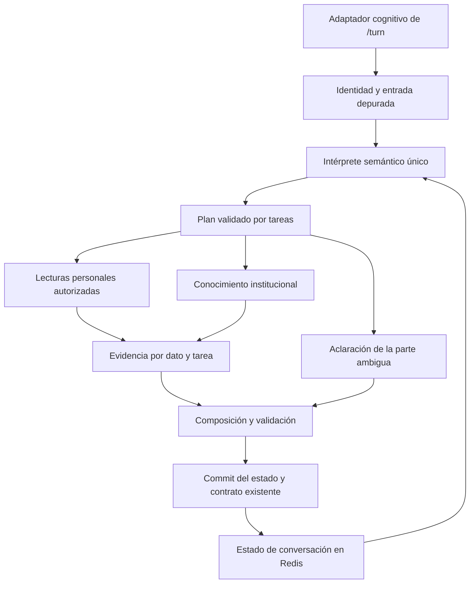

# Modelo de mejora de la capa cognitiva a partir de pruebas de QA

Banco Santa Cruz · 18 de septiembre de 2026

## Decisión propuesta

Evolucionar la capa cognitiva existente hacia un único flujo de interpretación y ejecución que pueda representar varias solicitudes, distinguir productos del catálogo de productos del cliente y mantener referencias conversacionales explícitas. El LLM interpreta lenguaje y redacta; el código valida identidades, campos, autorizaciones, cálculos y cambios de estado. Redis conserva ese estado compartido. Foundry y la recuperación documental aportan conocimiento institucional con fuentes.

La evidencia muestra capacidades útiles que conviene conservar, junto con fallos sistemáticos de ruteo, cobertura de subpreguntas y referencias. Añadir más condiciones por palabra o ampliar únicamente el Excel no resolverá esos fallos. La mejora debe medirse por tareas correctamente resueltas en conversaciones nuevas, no por cuánto texto genera el asistente ni por cuántas llamadas hace al modelo.

Se mantiene el frontend, el WebSocket y el orquestador externo. Es modificable la orquestación **interna** de la capa cognitiva, incluido su adaptador de `/turn`.

## Evidencia y límites del análisis

Se extrajeron los 236 escenarios del Word `cf44e3ee-0aeb-4571-8350-6a0eda40c4c9.docx`, sus criterios y las calificaciones registradas. El documento contiene 493 imágenes incrustadas. Se inspeccionaron visualmente 34 capturas seleccionadas de 24 escenarios, además de la captura independiente de misión y visión. No se transcribieron ni verificaron visualmente una por una las 493 imágenes.

También se contrastaron rutas y corpus con la copia histórica del ZIP disponible en esta conversación, bajo `review/BancaConversacional`. Esa copia precede a los cambios que Cursor ha reportado. Los hallazgos de código son indicios verificables de esa versión, no afirmaciones sobre el checkout o servicio actualmente desplegado. No se ejecutaron nuevas consultas remotas, ni se verificó el contexto bancario real de los clientes mostrados en las capturas.

El informe API previo indica `/turn` versión 0.8.0, `env=dev`, contexto `lab_fallback` y orquestador inaccesible durante esa corrida. El Word muestra otras sesiones y productos. No deben combinarse como si probaran el mismo despliegue, momento o cliente.

## Resultado registrado en el Word

| Grupo | Casos | Cumple | Parcial | No cumple |
|---|---:|---:|---:|---:|
| Consultas personales compuestas P | 15 | 0 | 8 | 7 |
| Contexto personal C | 8 | 3 | 2 | 3 |
| Desambiguación personal D | 10 | 0 | 4 | 6 |
| Correcciones R | 4 | 1 | 0 | 3 |
| Lenguaje y seguridad X | 10 | 5 | 2 | 3 |
| Conceptos e institucional IG | 20 | 14 | 6 | 0 |
| Crédito Diferido CD | 20 | 2 | 6 | 12 |
| Tarjetas de crédito TC | 16 | 8 | 7 | 1 |
| Tarjetas de débito TD | 8 | 6 | 2 | 0 |
| Préstamos PR | 15 | 11 | 4 | 0 |
| Cuentas CE | 8 | 5 | 3 | 0 |
| Procesos GR | 12 | 6 | 5 | 1 |
| Contexto de conocimiento CTX | 9 | 3 | 3 | 3 |
| Desambiguación de conocimiento DA | 10 | 0 | 0 | 10 |
| Transiciones general y personal MIX | 10 | 5 | 0 | 5 |
| Comparaciones CMP | 48 | 26 | 18 | 4 |
| Comparaciones encadenadas CC | 5 | 0 | 1 | 4 |
| Comparaciones ambiguas CA | 8 | 0 | 1 | 7 |
| **Total** | **236** | **95** | **72** | **69** |

El cumplimiento completo registrado es 40,3 %. El 59,7 % restante tiene resultado parcial o negativo. Son porcentajes de las etiquetas del documento; no constituyen una medición independiente de exactitud, una auditoría del Core ni un resultado de la futura solución.

Hay dos diferencias reveladoras: ninguna de las 15 consultas personales compuestas cumple completamente; tampoco cumplen completamente las cinco comparaciones encadenadas. En cambio, numerosas definiciones y comparaciones explícitas sí tienen resultados positivos. La pérdida aparece especialmente al combinar información o depender del turno anterior.

## Fallos observados y su interpretación

| Evidencia | Observación | Corrección propuesta |
|---|---|---|
| Captura independiente | Tras una tasa, «mision del banco» y «vision» reciben la misma aclaración genérica | Reconocer el cambio explícito al ámbito institucional y recuperar el concepto solicitado |
| P01, imágenes 3 y 4 | Después de pedir varios datos de tarjeta, «dame el multicrédito» vuelve a preguntar si quiere definición o datos | Resolver la selección contra el pendiente y conservar todos los campos solicitados |
| P10, imagen 27 | «ahora compárame mis certificados» vuelve a mostrar un certificado | Representar alcance múltiple y operación de comparación, separados del foco individual |
| P15, imágenes 40 y 41 | Las fichas muestran capital/balance pese a excluirlo en la solicitud | Conservar proyección de campos y exclusiones hasta la respuesta |
| CD06, imagen 186 | Pregunta explícita sobre uso de Multicrédito en el extranjero recibe un menú genérico | Resolver atributo y ámbito sin pedir una categoría ya expresada |
| CD13, imágenes 194 y 195 | Explicación general de pago mínimo deriva en selección de tarjeta personal | Separar definición/proceso de consulta personal |
| GR02, imagen 300 | Comparación de cancelación tarjeta/préstamo devuelve un importe personal de cancelación | Tipar acción informativa, entidades y fuentes; no activar payoff por la palabra cancelar |
| MIX07, imagen 404 | «¿Tengo yo ese producto?» tras Multicrédito devuelve saldo de una cuenta | Resolver existencia de producto en portafolio por identificador de catálogo y mapeo autorizado |
| CC02 y CC03 | Agregar un producto a una comparación dispara selección o ausencia de productos personales | Mantener una lista ordenada de entidades de catálogo independiente del portafolio |
| CA01 y CA08 | Preguntas sin referentes visibles reciben saldo de cuenta | Reconocer referente no resuelto; no usar un saldo como salida por defecto |
| X05 y X06 | Un secreto compartido en el mensaje se trata como referencia de producto | Detectar y redactar secretos antes de extraer identificadores, persistir o llamar al LLM |
| X07, imagen 144 | La pregunta por el esposo recibe un saldo presentado como «tu saldo» | No transformar una consulta de tercero en consulta del usuario; validar ámbito de autorización |

X07 no demuestra que se consultó la cuenta del esposo: la captura muestra una respuesta con el saldo presentado como propio. Es un fallo de interpretación de titularidad y control de respuesta que debe corregirse sin afirmar una filtración de terceros no probada.

Las capturas también muestran marcadores internos de citas y etiquetas técnicas en algunas respuestas. El adaptador de salida debe presentarlos en el formato que admite el contrato actual y mantener los identificadores de evidencia en la telemetría; la prosa no debe contener marcadores de proveedor sin resolver.

## Qué ocurre con misión y visión

La información existe en los archivos locales revisados:

- FAQ histórica `data/kb_faq_vf01.json`: entradas `vf01-r80` para misión y `vf01-r82` para visión.
- Paquete de conocimiento anterior: `kb_345bcee25daf0606f410b935.md` y `kb_0dde7aaff3b09848246897ca.md`, con referencia al Excel, hoja Matriz_Cuentas, filas 80–81 y 82–83. El paquete las marca como propuestas pendientes de aprobación.
- IG01 del Word muestra respuestas que contienen ambas definiciones y una comparación, aunque su calificación registrada es parcial.

Por ello, la imagen nueva no demuestra que falte el contenido en Foundry. Puede haber diferencias de despliegue, bypass, clasificación, estado o recuperación. Debe seguirse la traza del turno real.

En el código histórico, la frase exacta de aclaración genérica aparece en `brain/azure_intent_brain.py` y `brain/grounded_executor.py`. El detector `_is_explicit_knowledge_request` depende de expresiones como «qué es» y «explícame». La ejecución local aislada de ese detector devolvió `False` para «mision del banco», «visión» y «misión y visión», y `True` para «qué es la misión del banco». Esto reproduce una limitación del detector de esa copia; no reproduce por sí solo toda la ruta desplegada.

La corrección debe cubrir conceptos institucionales con distintas formulaciones, con y sin acentos, en sesión vacía, tras una consulta personal y durante una aclaración pendiente. Una consulta claramente institucional debe poder responderse sin snapshot personal disponible. Si no hay evidencia, informar que no se recuperó la definición, sin volver a preguntar si busca información del banco.

## Modelo de ejecución propuesto



No se propone una red nueva de agentes. Para este alcance, un intérprete semántico con herramientas acotadas y una política de ejecución explícita permite evaluar mejor los errores, controlar el costo y conservar la arquitectura existente.

### Interpretación con varias tareas

Un `IntentPacket` con un solo producto y un solo campo obliga a comprimir preguntas que contienen varias solicitudes. Se propone una representación interna `TurnPlan` con `tasks[]`, referencias, exclusiones y relaciones. Se puede mantener el tipo anterior mediante un adaptador para casos simples durante la migración.

Campos esenciales por tarea:

- `task_id`, `domain`, `action`, `object_type` y `fields[]`.
- `scope`: personal, catálogo o institucional; distinto de la cardinalidad single/all/compare.
- `entity_refs[]`: referencias de catálogo, candidatos personales o referencia al conjunto mostrado.
- `filters`: moneda, tipo, fechas o cantidad de movimientos, cuando aplique.
- `excluded_fields[]`, `depends_on[]` y `unresolved_slots[]`.
- Operador de comparación o agregado y criterios solicitados.

Ejemplo conceptual de «Dime la tasa y vencimiento de mis certificados y cuál vence primero, pero no el balance»:

```json
{
  "tasks": [
    {
      "task_id": "t1",
      "domain": "personal",
      "action": "read",
      "object_type": "term_deposit",
      "cardinality": "all",
      "fields": ["interest_rate", "maturity_date"],
      "excluded_fields": ["balance", "principal"],
      "depends_on": []
    },
    {
      "task_id": "t2",
      "domain": "personal",
      "action": "compare",
      "object_type": "term_deposit",
      "cardinality": "all",
      "fields": ["maturity_date"],
      "operator": "earliest",
      "depends_on": ["t1"]
    }
  ]
}
```

Es un ejemplo parcial para explicar el diseño, no el JSON Schema final ni una llamada ejecutable. Los identificadores personales definitivos los resuelve el servidor contra el snapshot autorizado. Un identificador propuesto por el LLM nunca concede acceso.

Structured Outputs sirve para imponer la estructura de ese plan; no demuestra que la interpretación sea correcta. Se debe validar además la semántica de acciones, campos, referencias y dependencias. La compatibilidad de modelo/API/SDK debe comprobarse en el despliegue existente, sin migrarlos por iniciativa de esta propuesta. [Microsoft sobre Structured Outputs](https://learn.microsoft.com/en-us/azure/foundry/openai/how-to/structured-outputs).

### Una autoridad semántica dentro de la capa cognitiva

Todos los mensajes de lenguaje natural deben producir o reutilizar un plan antes de ejecutar una respuesta de negocio. Los handlers deterministas existentes se conservan como ejecutores de planes y validadores de hechos. Las selecciones inequívocas de un pendiente pueden resolverse sin otra llamada al modelo, siempre que produzcan la misma representación y conserven las tareas restantes.

Las reglas de seguridad se aplican primero. Los atajos por palabras que devuelven una respuesta completa sin validar el mensaje entero deben perder esa capacidad gradualmente. «Tengo», «tasa», «cancelar», una expresión de frustración o un saludo no pueden consumir una solicitud compuesta. La emoción modifica el tono, no borra la tarea bancaria.

La salida ante error del modelo debe distinguir error técnico de ambigüedad. Una respuesta puede usar un ejecutor determinista conocido cuando sus precondiciones están satisfechas; si no, debe reconocer la limitación sin inventar un saldo, una definición ni un compromiso de atención humana.

### Estado conversacional por ámbito

Mantener por sesión los siguientes elementos tipados:

- `personal_focus`: producto del cliente, tipo, moneda y campo previo.
- `knowledge_focus`: concepto o producto del catálogo y faceta activa.
- `process_focus`: proceso consultado y etapa, sin equivaler a una operación realizada.
- `comparison_set`: entidades ordenadas, ámbito y criterios; incluir el orden efectivamente presentado.
- `pending_tasks`: tareas pendientes completas y opciones ofrecidas, no solo una etiqueta de intención.
- `reference_frames`: menciones recientes con ámbito, origen y estado de resolución.
- Historial reciente depurado y resumen compacto; revisión, versión de esquema y fecha del snapshot.

Una referencia se resuelve primero contra lo explícitamente dicho o corregido en el turno, luego contra un pendiente compatible y después contra un foco compatible. «La otra» exige que haya una alternativa identificable; si quedan varias, se pregunta cuál. «Las dos» se refiere al conjunto conversacional válido, no a dos productos arbitrarios del portafolio.

Una excursión a misión o visión puede conservar un foco personal anterior, pero «¿y la tasa?» después de hablar de un producto del catálogo no debe saltar automáticamente al préstamo personal. Debe evaluarse la compatibilidad y la ambigüedad real entre marcos.

El código aplica una transición propuesta sobre una copia del estado. Publica la respuesta definitiva después del commit exitoso según el mecanismo de CAS/candado compatible ya implementado. No rehacer estos mecanismos por defecto. Redis no repara un estado semántico mal construido.

### Desambiguación proporcional

Preguntar solo por los datos que faltan para decidir. Distinguir:

- Falta de referente: «¿Cuál de las dos?» sin conjunto identificado.
- Referente inequívoco, dato ausente: se sabe qué préstamo, pero falta el monto de cuota.
- Falta de evidencia documental: se conoce el tema, pero no se recupera su condición.
- Falta de herramienta: el sistema no dispone de movimientos o cotización de cancelación.
- Fallo técnico: la fuente o modelo no responde.

Solo la primera situación requiere elegir producto o referente. Una aclaración no arregla un campo ausente ni un servicio caído. En una pregunta mixta, responder la parte independiente sustentada y aclarar la parte bloqueada. Guardar el plan para reanudarlo sin exigir que el cliente lo repita.

Detectar aclaraciones repetidas sin progreso. Reinterpretar el último mensaje con el plan pendiente y ofrecer una pregunta concreta; si sigue siendo irresoluble, explicar el límite. El límite de repeticiones no autoriza a adivinar.

### Herramientas y hechos tipados

Crear un registro de capacidades a partir de los adaptadores existentes. Puede incluir lectura del snapshot, selección autorizada de productos, lectura de campos, recuperación documental y cálculos deterministas de comparación. Los nombres son internos y deben mapearse a capacidades reales.

Separar para cada campo: semántica, ruta real del contrato de contexto, tipo, moneda/unidad, frescura, procedencia y comportamiento ante ausencia. No dar por equivalente saldo disponible, saldo actual, capital pendiente, total adeudado o monto de cancelación. El dato de cancelación requiere su campo o cotización autorizada; no se obtiene renombrando el capital.

Representar los resultados como registros de evidencia con `task_id`, entidad autorizada, campo, valor, unidad/moneda, fuente, fecha y estado. Estados sugeridos: available, missing, stale, unsupported, error. Conservar decimales exactos y separar monto de fecha.

Ordenar fechas, calcular mínimos y sumar importes del mismo concepto y moneda mediante código. No sumar DOP y USD ni comparar porcentajes con distinta periodicidad sin una regla autorizada. Para «pagos próximos» se necesita un horizonte explícito o una política configurada visible en la respuesta.

### Conocimiento y taxonomía

La taxonomía dominio → acción → objeto → campo debe describir significado, no convertirse en otra lista cerrada de frases. Separar cuatro activos:

1. Taxonomía semántica con identificadores y alias, jerarquía y ámbitos.
2. Registro técnico de capacidades y mapeos a campos realmente disponibles.
3. Corpus de hechos y procedimientos institucionales aprobado por el banco.
4. Banco de evaluación con entradas y criterios esperados.

No subir las capturas de QA, secretos de ejemplo, saldos de clientes o respuestas fallidas al conocimiento de Foundry. Las preguntas de evaluación pueden servir para medir cobertura, pero no como hechos bancarios ni como justificación de respuestas.

Cada unidad de conocimiento debe contener tema, ámbito/producto de catálogo, faceta, texto completo, fuente Excel/hoja/filas, versión, vigencia y estado de revisión. No deduplicar únicamente por tema: «pago mínimo» de dos productos no implica una misma regla.

El retriever debe recibir la consulta contextualizada y sus entidades/facetas. Recuperar para cada producto de una comparación; un único top-k global puede dejar fuera al segundo producto. Recomiendo evaluar búsqueda híbrida lexical/vectorial y reranking con los filtros necesarios. Azure AI Search combina resultados textuales y vectoriales en una búsqueda híbrida; esa capacidad es una opción técnica, no una garantía de exactitud. [Microsoft sobre búsqueda híbrida](https://learn.microsoft.com/en-us/azure/search/hybrid-search-overview).

Mantener una interfaz única de conocimiento para FAQ y Foundry/Search. Ambas rutas deben compartir versión de corpus y criterios de elegibilidad. No agregar una tercera base independiente ni hacer varias consultas redundantes por turno. La caché necesita incorporar las entidades/facetas resueltas y versiones pertinentes; no almacenar datos personales en una caché global de respuestas.

**Actualización de Foundry:** verificar primero qué agente, corpus e índice utiliza realmente QA. Para misión/visión ya existe contenido local: auditar su presencia, versión y recuperación en la ruta activa. Para Multicrédito y otras familias con muchos fallos, separar condiciones ausentes de respuestas que no llegaron al retriever. Preparar cambios de corpus solo para brechas verificadas, con trazabilidad y revisión; desplegarlos en un recurso de QA cuando se autorice esa actualización.

### Composición de respuesta

El compositor consume el plan y la evidencia por tarea. Cada solicitud debe quedar contestada, aclarada, marcada como dato no disponible o capacidad no soportada. No omitirla silenciosamente. En P15, ni el texto ni las tarjetas de salida deben volver a agregar el balance excluido.

La redacción puede ser natural, pero los valores financieros deben renderizarse desde registros verificados. Comparar conjuntos de números del texto es insuficiente: un redactor puede intercambiar moneda o producto conservando los mismos números. Validar la asociación entidad/campo/valor/moneda/fecha y la cobertura de las tareas. Un fallback de plantilla debe conservar todos los hechos y límites validados.

## Orden de implementación

| Incremento | Trabajo concreto | Evidencia de cierre |
|---|---|---|
| 0 | Identificar commit desplegado, flags, rutas, origen de contexto y baseline depurado | Manifiesto del entorno y trazas mínimas de `/turn`; sin éxito Azure inferido por latencia |
| 1 | Entrada depurada, titularidad, errores explícitos, misión/visión y salida sin saldo por defecto | Casos X05–X07 e institucionales nuevos; regresiones de definición y consultas personales |
| 2 | Plan de varias tareas, resolución y transiciones de estado; retirar bypass semántico en las familias migradas | P01–P15, C/R, casos de cambio de tema y selección pendiente |
| 3 | Catálogo separado del portafolio, conocimiento contextual, comparaciones y conjunto ordenado | CD, DA, MIX, CMP, CC y CA con fuentes por entidad |
| 4 | Composición por evidencia y cobertura; renderizado financiero y normalización de citas | Todas las subpreguntas atendidas; sin mezcla de campos, unidades ni entidades |
| 5 | QA con modelo real y contexto autorizado, prueba por interfaz y Redis distribuido | Resultados reales por componente, sin sustituirlos por mocks o escenarios omitidos |

Los incrementos son dependencias de implementación, no una petición de detenerse después de cada parche. Cursor puede completar los cambios locales y dejar un paquete revisable. El paso a servicios compartidos debe mantener el alcance autorizado y el mecanismo de despliegue del equipo.

## Evaluación que debe acompañar el cambio

El baseline necesita revisión antes de convertirse en la verdad de los tests. D04 incluye una captura donde se ven preguntas previas sobre un préstamo: si el foco estaba correctamente establecido, responder su tasa puede ser apropiado. IG01 muestra las tres partes solicitadas, a pesar de la etiqueta parcial; puede existir un problema de fuente o exactitud no explicado por la anotación genérica. No cambiar automáticamente sus etiquetas: registrar esta discrepancia y reproducir.

Para cada caso definir sesión inicial limpia o estado exacto, portafolio necesario, capacidades disponibles, secuencia de turnos, evidencia esperada y versión del sistema. Una pantalla de bienvenida no prueba que la sesión del servidor se haya reiniciado. Los casos que requieren varios productos no se califican con un cliente que solo tiene uno. Los movimientos inexistentes deben marcarse no disponibles, no inventarse para cumplir una pregunta.

No se debe exigir coincidencia textual de la prosa. Medir extracción de tareas, resolución de entidades, transiciones, adecuación de aclaraciones, recuperación, campos exactos, cobertura final, latencia y fallbacks. Combinar assertions deterministas con revisión de conocimiento y evaluadores de relevancia/grounding/completitud. Los evaluadores de Foundry permiten separar recuperación y calidad de respuesta, pero no reemplazan la verificación de montos ni de autorizaciones. [Evaluadores RAG de Microsoft](https://learn.microsoft.com/en-us/azure/foundry/concepts/evaluation-evaluators/rag-evaluators).

Metas propuestas para acordar antes del release: 100 % de controles críticos en la suite; cero valores financieros inventados o atribuibles a otro producto; 100 % de fallos conocidos críticos corregidos; al menos 95 % de resolución de entidades y continuidad en un conjunto reservado; al menos 95 % de cobertura de subintenciones aplicables. El cumplimiento de estos umbrales se mide, no se promete como resultado de este diseño.

Separar los 236 escenarios de desarrollo de variantes reservadas por familia y conversación. No colocar paráfrasis casi idénticas en ambos conjuntos. Conservar los casos aprobados como regresión después de adjudicar su evidencia. Medir por familia para que muchas definiciones simples no oculten fallos de desambiguación.

## Qué se conserva y qué se cambia

Se conservan `/turn`, los contratos del consumidor externo, los conectores existentes, los adaptadores de contexto, el corpus con trazabilidad y el trabajo de CAS, frescura y candados reportado. Se verifica su presencia antes de reutilizarlos. La selección de estado ocupado o error de carga continúa usando el comportamiento ya acordado con el consumidor, no un nuevo contrato.

Se cambia la autoridad que decide qué se pregunta y cómo se mantienen las referencias. El conocimiento, el portafolio, la seguridad, el redactor y el estado dejan de competir mediante detectores independientes. Todos reciben el mismo plan validado, mientras cada componente conserva su responsabilidad.

No se propone entrenar un modelo desde cero, un fine-tuning inmediato, una migración completa de SDK, una reescritura del orquestador externo ni una arquitectura multiagente adicional. Primero se debe demostrar mejora con interpretación semántica, fuentes y estado coherentes. Redis y Foundry habilitan esas capacidades; la política cognitiva debe utilizarlas correctamente.
